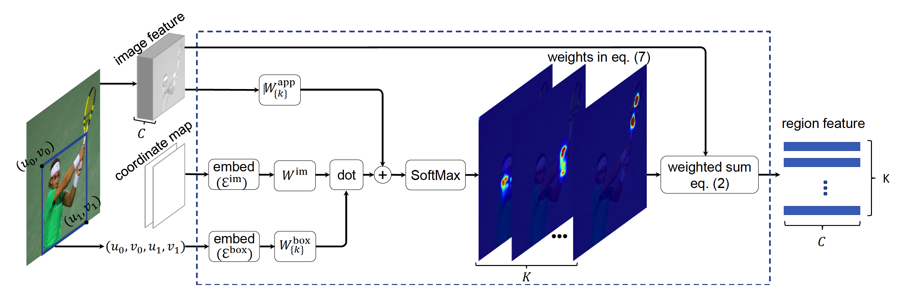
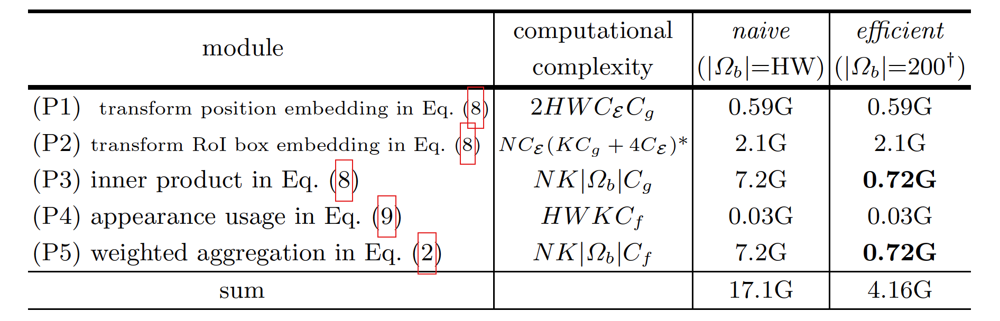
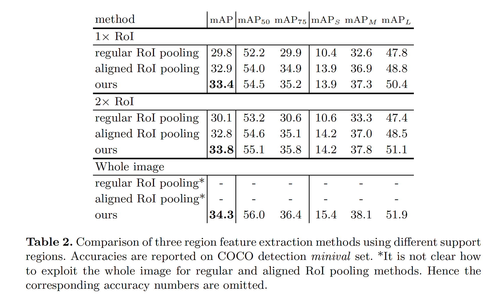
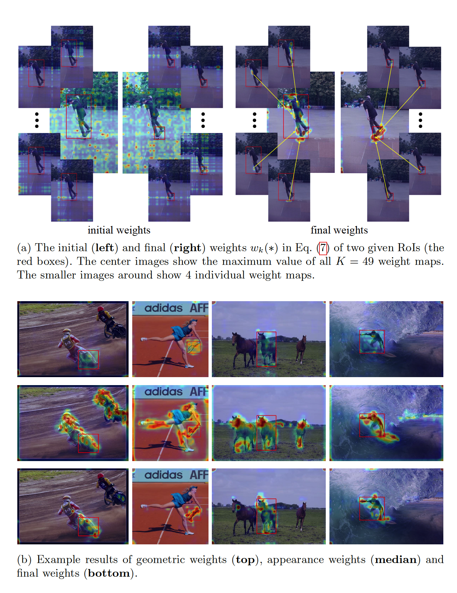

## Learning Region Features for Object Detection (ECCV 2018)
<!-- 本文是北大信科的王立威老师团队的作品。ECCV 2018 论文。 -->

### Introduction
- 作者把目标检测问题分成以下几个步骤：
	- object detection paradigm:
		- image feature generation (CNN)
		- region proposal generation (RPN)
		- region feature extraction (RoI pooling)
		- region recognition (Fast R-CNN)
		- duplicate removal (NMS)
	其中图片特征产生、proposal 产生、region 识别问题陆陆续续已经有一些 learnable 的方法提出。duplicate removal 也有可以学习的方法。但是提取 region feature 这个环节一直使用手工的 RoI pooling 的方法。
- Region Feature Extraction 可以建模为：

$$\mathbf{y}(b)={\rm RegionFeat}(\mathbf{x}, b)$$
其中，$\mathbf{x}$ 为image feature generation 提取的 feature，channel 数为 $C_f$，$\mathbf{y}(b)$ 维度为 $K\times C_f$，$K$ 表示 region 中的 spatial parts 的数目，例如在 RoI pooling 中常用的值为 $K=7\times7$。

模型可以进一步建模为：

$$\mathbf{y}_k(b)=\sum_{p\in\Omega_b}w_k(b,p,\mathbf{x})\odot\mathbf{x}(p)$$
其中，$\Omega_b$ 为 supporting region，可以为 RoI，也可以为包含一些 context 的 RoI，甚至可以是整张图片。$p$ enumerate $\Omega_b$。假设权重归一化 $\sum_{p\in \Omega_b}w_k(b,p,\mathbf{x})=1$。

几种具体形式：  
*Regular RoI Pooling*

$$w_k(b, p) = \left\{ \begin{array}{lll} 1/|R_{bk} & \rm{if} & p \in R_{bk} \\ 0 & \rm{else} \end{array}\right.$$

*Aligned RoI Pooling*

$$w_k(b, p) = g(u_p,u_{bk})\cdot g(v_p, v_{bk})$$
其中，$p=(u_p,v_p)$，$g(a,b)=\max(0,1-|a-b|)$ 表示一维的双线性插值，$u_bk$，$v_bk$是每个 bin 的中心。

以上的权值都是 hand-crafted，并且$w_k(\cdot)$ 与 $\mathbf{x}$ 没有关系。

### Learning Region Features

思路：设计可以学习的权重 $w_k(b,p,\mathbf{x})$，使用最少的 hand-craft。


直觉上，影响权重的两个因素：  
1. $p$ 和 $b$（RoI box） 的几何关系。
2. 离 $b$ 近的 $p$ 贡献应该比很远的大。

提出

$$w_k(b,p,\mathbf{x})\varpropto \exp(G_k(b,p)+A_k(\mathbf{x},p))$$
$G_k(b,p)$ 描述*几何关系*

$$G_k(b,p)=\langle W_k^{\rm{box}}\cdot\mathcal{E}^{\rm{box}}(b),W^{\rm{im}}\cdot\mathcal{E}^{\rm{im}(p)}\rangle$$

上式的计算分为三步：
1. embed box and image position into high dimensional spaces

$$\mathcal{E}_{2i}(z)=\sin(\frac{z}{1000^{2i/C_\mathcal{E}}}),\mathcal{E}_{2i+1}(z)=cos(\frac{z}{1000^{2i/C_\mathcal{E}}}).$$   
其中 $\mathcal{E}(z)$ 的维度为 $C_\mathcal{E}$

2. embedding vector 通过可学习的权重矩阵 $W^{im}$ 和 $W^{box}$ 进行线性变换。
3. 对两个变换后的向量计算内积，作为 geometric relation weight。

$A_k(\mathbf{x},p)$ 自适应地使用 image features，对 image feature 使用 $1 \times 1$ 的卷积。

$$A_k(\mathbf{x}, p)=W_k^{\rm{app}}\cdot\mathbf{x}(p)$$

提出的 region feature extraction module 如下图所示。  

### 实验结果
复杂度分析  

COCO 上的实验结果：  

权重可视化后的结果：  
